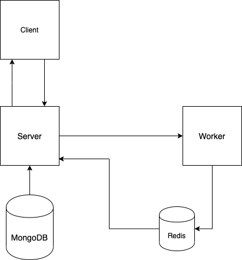

# K8s Arabic / Roman Numerals

This a project trying to understand various concepts about dockerizing javascript applications and trying create manifest files for k8s.

## Overview

This is a summary of the services that are being created in this project

<p align="center">
    
</p>

**Services**

- [Client](./client/README.MD)
- [Server](./server/README.MD)
- [Worker](./worker/README.md)
- NGINX

## Preview

You can run the whole project locally either by using docker with the command
`docker-compose up` or with `minikube`, or you can create a k8s cluster on one provider like GCP or AWS.

## Docker

Each service has a dedicated file for development and production. The development Dockerfiles marked with suffix .dev give the ability for live reloading while coding.

**Useful Commands**

- Build Specific Dockerfile
  ```bash
  docker build -f Dockerfile.dev -t <tagName> .
  ```
- Run an existing image
  ```bash
  docker run -p sourcePort:DestinationPort <tagName> / <image ID>
  ```
- Get container's logs
  ```bash
  docker logs <container ID>
  # or have -f , --follow Follow log output
  ```
- Run `sh` inside running container
  ```bash
  docker exec -it <container ID> sh
  ```
- Override containers starting command
  ```bash
  docker run -it <container ID> sh
  ```

**For docker-compose**

- To start all the services
  ```bash
  docker-compose up
  # --build if you want to build all the images again
  # -d, --detach if you want to detach it for terminal
  ```
- To stop all the services
  ```bash
  docker-compose down
  ```
- You can build individual services or stop or run

  ```bash
  docker-compose stop/run/build <service Name>
  ```

## Kubernetes

