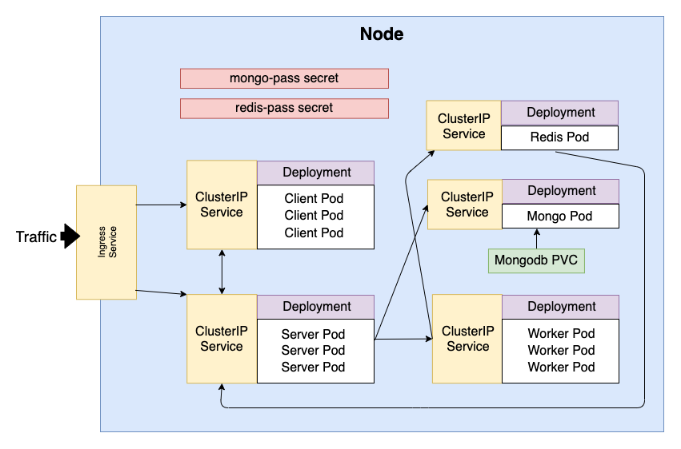

# K8s Arabic / Roman Numerals

This a project trying to understand various concepts about dockerizing javascript applications and trying create manifest files for k8s.

## Overview

This is a summary of the services that are being created in this project

<p align="center">
    
</p>

**Services**

- [Client](./client/README.MD)
- [Server](./server/README.MD)
- [Worker](./worker/README.md)
- NGINX

## Preview

You can run the whole project locally either by using docker with the command
`docker-compose up` or with `minikube`, or you can create a k8s cluster on one provider like GCP or AWS.

## Docker

Each service has a dedicated file for development and production. The development Dockerfiles marked with suffix .dev give the ability for live reloading while coding.

**Useful Commands**

- Build Specific Dockerfile
  ```bash
  docker build -f Dockerfile.dev -t <tagName> .
  ```
- Run an existing image
  ```bash
  docker run -p sourcePort:DestinationPort <tagName> / <image ID>
  ```
- Get container's logs
  ```bash
  docker logs <container ID>
  # or have -f , --follow Follow log output
  ```
- Run `sh` inside running container
  ```bash
  docker exec -it <container ID> sh
  ```
- Override containers starting command
  ```bash
  docker run -it <container ID> sh
  ```

**For docker-compose**

- To start all the services
  ```bash
  docker-compose up
  # --build if you want to build all the images again
  # -d, --detach if you want to detach it for terminal
  ```
- To stop all the services
  ```bash
  docker-compose down
  ```
- You can build individual services or stop or run

  ```bash
  docker-compose stop/run/build <service Name>
  ```

**Images on Docker Hub**

- [gkabitakis/server](https://hub.docker.com/repository/docker/gkabitakis/server)
- [gkabitakis/worker](https://hub.docker.com/repository/docker/gkabitakis/worker)
- [gkabitakis/client](https://hub.docker.com/repository/docker/gkabitakis/client)

## Kubernetes

<p align="center">
    
</p>

**Local Deployment** with [minikube](https://github.com/kubernetes/minikube).

**Useful Commands**

- `minikube start` For starting minikube.
- `minikube delete` For deleting all contents.
- `minikube ip` Get the ip of the minikube.


### Steps in order to run this locally on minikube:

- Setting secrets for `redis` and `mongodb`.
  ```bash
  kubectl create secret generic redis-pass --from-literal="REDIS_PASS=<password>"

  kubectl create secret generic mongo-pass --from-literal="MONGO_PASS=<password>"

  # You can verify that they are created by running
  kubectl get secrets
  ``` 
- Create the persistent volume claim for MongoDB.
  ```bash
  kubectl apply -f database-pvc.yaml
  ```
- Create both deployments for the databases (redis/mongo).
  ```bash
  kubectl apply -f redis-deployment.yaml

  kubectl apply -f mongo-deployment.yaml
  ```
- Finally you can apply all the services in this order worker, client, server and finally the ingress.

If everything is working correctly you can navigate to your browser at minikube's IP.
